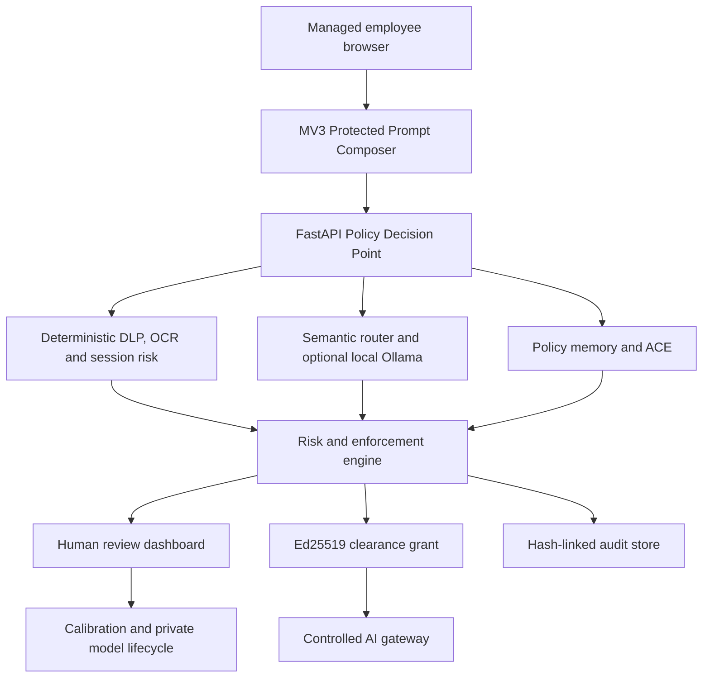

# GHST Architecture

## Runtime topology



## Decision precedence

1. Parsing and policy-store availability.
2. Deterministic hard prohibition.
3. Zero-sensitive-data-egress rule.
4. Destination trust.
5. Rolling-session fragmentation evidence.
6. Active policy conflict.
7. Classification confidence and abstention.
8. ACE hard-context predicate and similarity.
9. Composite risk score.
10. Default safe policy.

A lower-priority signal cannot weaken a higher-priority control. The local model is contextual evidence, never the security boundary.

## Trust boundaries

- Organisation-controlled: extension, PDP, Supabase PostgreSQL, policy memory, ACE and audit store.
- Optional organisation-controlled path: local Ollama-backed model inference when enabled.
- External: employee-facing AI destination.
- Raw input can enter the internal PDP over authenticated transport but cannot cross the gateway until the final release predicate is true.
- The model container has no public port or Internet route in either Docker profile.
- In production, only the API joins the controlled-egress network. It is allowlisted to the organisation-owned Supabase Session pooler and approved downstream; web, Ollama and the TLS edge remain internal.

## Database portability and Supabase boundary

One SQLAlchemy model and Alembic history supports Supabase PostgreSQL, local PostgreSQL and SQLite tests. Production supplies the TLS-enforced Supabase URI only to FastAPI. Browsers never receive Supabase credentials. Migration `0003` enables RLS on GHST tables and revokes Supabase Data API privileges from `anon` and `authenticated`, so the API's signed-identity RBAC remains the sole application access path.

## ACE learning predicate

```text
Reusable(x, p) = Active(p)
                 AND SameOrganisation(x, p)
                 AND (SameDepartment(x, p) OR PolicyAdminGlobalScope(p))
                 AND SameRole(x, p)
                 AND SamePurpose(x, p)
                 AND SameDataClass(x, p)
                 AND SameImpactClass(x, p)
                 AND SameDestinationAndTenant(x, p)
                 AND SameApplicablePolicyVersionSet(x, p)
                 AND Risk(x) <= RiskCeiling(p)
                 AND Similarity(x, p) >= Threshold
```

Expiry, revocation, reuse exhaustion or policy activation invalidates reuse before semantic comparison can authorise anything.

High-impact precedent creation first enters `PENDING_SECOND_REVIEW`. It cannot match a request until a different authorised reviewer approves it. Only a Policy Administrator can promote an active department precedent to `GLOBAL` scope.

## Governed model lifecycle

```text
Authorised model candidate metadata
  -> training or evaluation report registration
  -> CANDIDATE
  -> held-out + adversarial + regression gates
  -> EVALUATED
  -> human-authorised SHADOW
  -> human-authorised PRODUCTION
  -> preserved rollback target
```

This repo implements the governance workflow around candidate models, evaluations, shadowing, promotion and rollback. It does not itself perform end-to-end private LoRA or QLoRA training inside the application runtime. Live reviews never mutate weights. Organisation-specific production selection is resolved from the database; absent a valid promoted model, the configured local model path is used and failures abstain safely.

## Persistence model

Standard records persist a prompt HMAC, findings, policy matches, decision metadata and audit evidence. Raw input exists only in process memory, except encrypted temporary review evidence with TTL for human review. ACE stores hashed semantic signatures and bounded precedent metadata rather than openly stored reviewed prompts. Rolling-session analysis persists only categorical counters and cumulative risk, not prompt fragments. Usability evidence contains task metrics and pseudonymous participant hashes, never prompt content.
